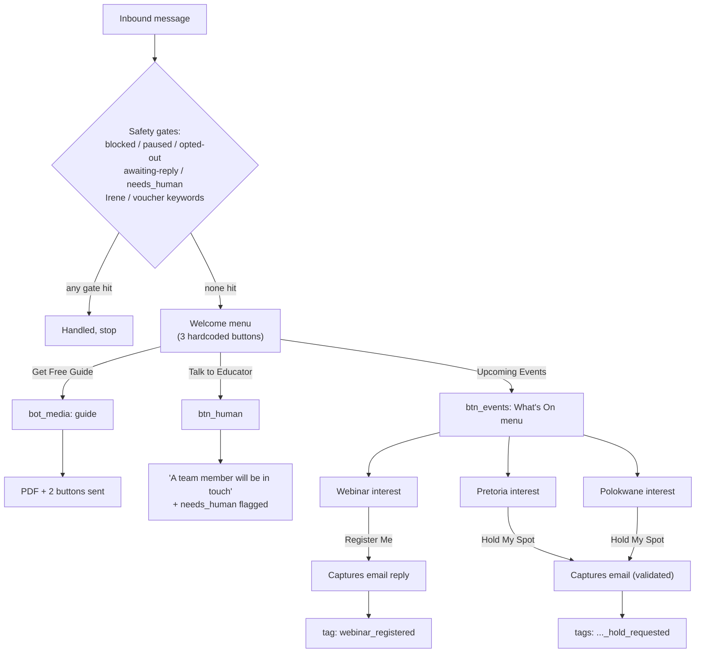
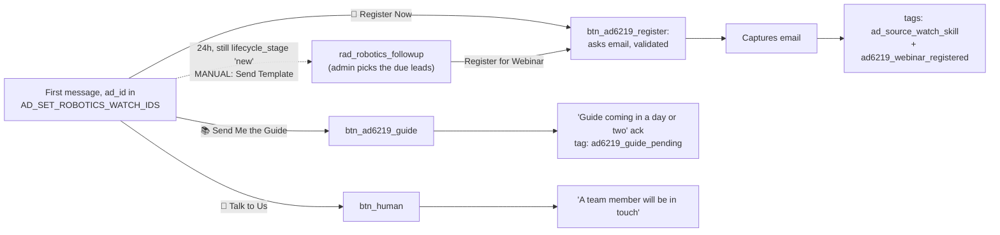
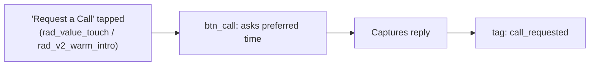
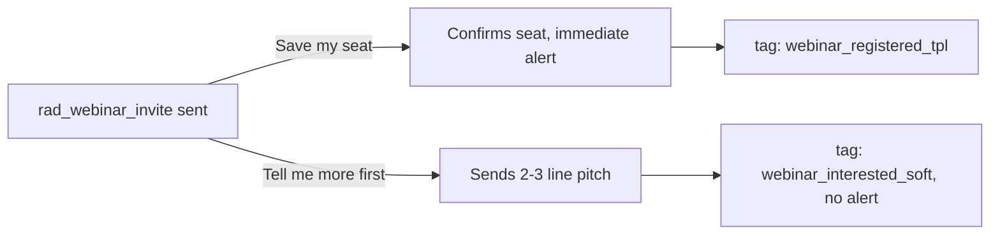
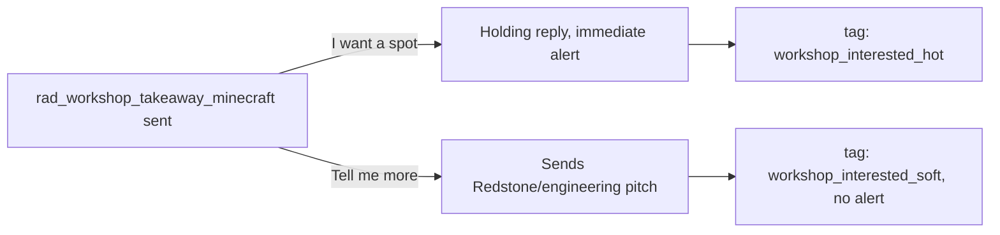
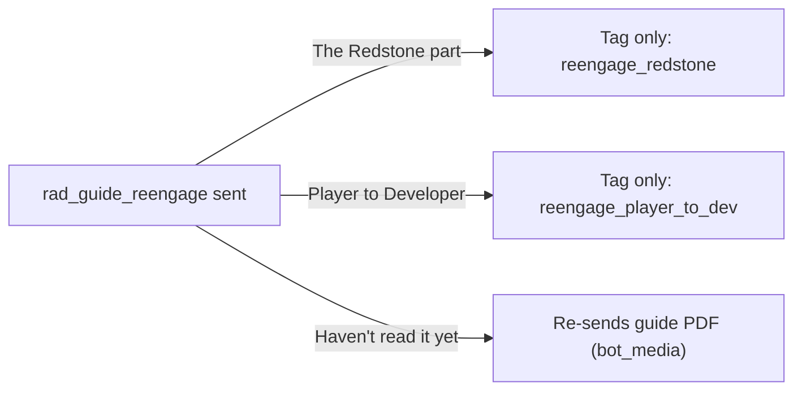
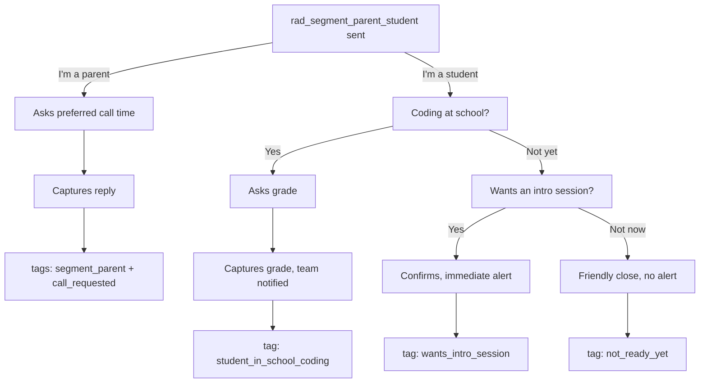
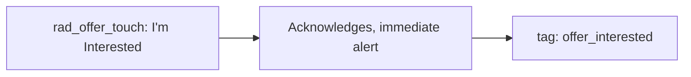

# Lead-Funnel Automation Map

Every configured bot flow, media item, and approved template, cross-checked against what's live on Meta — what actually fires when a lead messages in.

26 bot_flows &middot; 3 bot_media &middot; 11 approved templates &middot; 4 wizard rollouts, all linked
Updated 2026-09-09 &middot; source: `src/app/api/whatsapp-webhook/route.ts`, `bot_flows`, `bot_media`, `template_rollouts`, `src/lib/adFollowups.ts`

This supersedes `docs/whatsapp-webhook-system.md`, which predates `bot_flows` entirely and is safe to retire in favor of this page.

---

## The automation chain

Every button below resolves to a distinct, tagged outcome. This covers the welcome menu and everything Upcoming Events leads to; each approved template has its own diagram further down.

### bot_flows — every configured trigger

Looked up by `trigger_button_id` the instant a lead taps a button — either one the bot sent, or a quick-reply on an approved template. All 7 rows below are `active`.

| Trigger id | Label | Type | Does | Tags / source | Notify |
|---|---|---|---|---|---|
| `btn_events` | What's On menu | message | "Here's what's coming up" + 3 buttons → Webinar / Pretoria / Polokwane | — | — |
| `btn_webinar` | Webinar interest | message | Sends webinar copy (`{{dates}}` live from Featured Programs) + "Register Me" button | `source: warm_list_whats_on_webinar` | buffered |
| `btn_pretoria` | Pretoria interest | message | Same pattern, Pretoria dates + "Hold My Spot" button | `source: warm_list_whats_on_pretoria` | buffered |
| `btn_polokwane` | Polokwane interest | message | Same pattern, Polokwane dates + "Hold My Spot" button | `source: warm_list_whats_on_polokwane` | buffered |
| `btn_register_webinar` | Webinar Registration | message | Asks for email, **captures the next free-text reply**, confirms, hands to human | `add_tags: email`, `completion: webinar_registered` | buffered |
| `btn_call` | Request a call | message | Asks preferred time, captures reply, confirms, hands to human | `add_tags: call_time`, `completion: call_requested` | buffered |
| `btn_guide` | Get Free Guide | bot_media | Delivers the current guide PDF (keyword `guide`) | — | off |

`btn_human`, the two Hold My Spot buttons, and everything triggered from an approved template's own quick-replies are below.

### Now wired: welcome-menu gaps

Three buttons referenced above had no row of their own until this build.

| Trigger id | Label | Does | Tags / source | Notify |
|---|---|---|---|---|
| `btn_human` | Talk to Educator | "Thanks for reaching out — a team member will be in touch with you shortly! 👋" — flags `needs_human` | — | immediate |
| `btn_hold_pretoria` | Pretoria — Hold My Spot | Asks for email ("so I can send your quote"), **validates it's a real address** before accepting | `completion: pretoria_hold_requested` | immediate |
| `btn_hold_polokwane` | Polokwane — Hold My Spot | Same pattern as Pretoria | `completion: polokwane_hold_requested` | immediate |

### Email verification on captured replies

New capability, not just new copy: an `expects_reply` flow can now require `reply_validation: 'email'`. The webhook pulls an email address out of the reply with a regex — `"my email's jane@example.com, thanks!"` validates just as well as a bare address — and only accepts it as the answer if one is actually found, extracted onto the lead's own `email` field (not just logged as a note). If nothing valid is found, the reply is **never** captured as the answer: the lead instead gets a friendly hand-off ("I couldn't quite catch a valid email there… a team member will be in touch") and the admin gets an immediate alert with what they actually said. Configurable per-flow from `/admin/bot-flows` — both Hold My Spot flows use it now.

---

## Ad-specific first contact: the "robotics watch" ad set

The first ad-gated greeting in the system — scoped to a specific Meta ad *set* (multiple ad creatives, one campaign, matched on Meta's `referral.source_id`), not "any ad referral." A lead whose *first* message carries one of this set's `ad_id`s gets a purpose-built pitch instead of the generic welcome menu; every other ad keeps today's generic welcome. The first-contact greeting is still automatic; the 24h-silence follow-up that used to fire automatically after it was reverted to a manual send on 2026-09-10 (see below) — this system still has no automated *delayed* send.

| `ad_id` | Ad headline |
|---|---|
| `120248999130920372` | "The skill your watch doesn't teach" |
| `120248999130910372` | "Ask them what they'd rather do" |

| Trigger id / mechanism | Does | Tags | Notify |
|---|---|---|---|
| `btn_ad6219_register` | Asks for email (validated), captures it, confirms webinar link + calendar invite on the way | `add_tags: ad_source_watch_skill`, `completion: ad6219_webinar_registered` | immediate |
| `btn_ad6219_guide` | Acknowledges the guide isn't ready yet ("a day or two") — no PDF sent, since none exists | `add_tags: ad6219_guide_pending` | buffered |
| `btn_human` | Reused as-is — same "team member will be in touch" copy, no separate row needed | — | immediate |
| ~~`sendAdFollowups()`~~ (removed 2026-09-10) | Manual now — see below | — | — |

**Reverted to manual 2026-09-10**: the 24h nudge originally went out as a freeform/interactive message, which Meta unconditionally rejects once the customer-service window has closed (error 131047) — and this send only ever fired *after* 24h of silence, so the window was guaranteed closed every time. All ~19 real sends failed this way. On 2026-09-09 this was fixed by submitting a dedicated pre-approved template, `rad_robotics_followup` (MARKETING, en, one QUICK_REPLY button → `btn_ad6219_register`), which is exempt from the 24h window — but after seeing the string of failed sends in the Outbox, the decision was made to drop the automated poll entirely rather than keep debugging it. `sendAdFollowups()` and its call from `notify-flush` are gone; `src/lib/adFollowups.ts` now only exports the ad-set matching helper (`isRoboticsWatchAd`) that the first-contact greeting still needs.

**Send it manually instead**: `rad_robotics_followup` is an approved template, so it's already available from the Lead Funnel table's **Send Template** bulk action — select the due leads (ad set + no reply since first contact), pick the template, and set its one quick-reply button's payload to `btn_ad6219_register` so a tap still routes through Bot Flows exactly like the automated version would have.

**Graceful upgrade path (on hold)**: the real robotics guide still doesn't exist. Once it's ready, a second template with a document header can be submitted via the Template Rollout Wizard for the same manual-send flow. `btn_ad6219_guide` itself still just needs its action type flipped to `bot_media` from `/admin/bot-flows` at that point.

---

## Request a Call

A standalone flow, not tied to the welcome menu — reached whenever a template's "Request a Call" quick-reply has its payload set to `btn_call` (`rad_value_touch` and `rad_v2_warm_intro` both have one). Also reachable manually from the Message Activity reply picker.

---

## Now wired: approved-template quick-replies

Every button on the 4 wizard-built templates, plus `rad_offer_touch`'s buying-intent button. Remember: these only fire once the template is actually sent with the matching payload set on each button.

### Webinar Invite

### Workshop Takeaway

### Guide Reengage

### Segment: Parent/Student

The only multi-step flow in the system, built by chaining trigger ids the same way as everything else here — no schema change needed.

### Offer Touch

### Full trigger-id reference

| Template | Button | Trigger id | Does |
|---|---|---|---|
| `rad_webinar_invite` | Save my seat | `btn_webinar_tpl_seat` | Confirms the seat, tags `webinar_registered_tpl`, immediate team alert |
| | Tell me more first | `btn_webinar_tpl_more` | Sends the 2–3 line pitch, tags `webinar_interested_soft` (no alert — tracked, not urgent) |
| `rad_workshop_takeaway_minecraft` | I want a spot | `btn_workshop_tpl_spot` | Holding reply, immediate team alert |
| | Tell me more | `btn_workshop_tpl_more` | Sends the Redstone/engineering pitch, tags `workshop_interested_soft` |
| `rad_guide_reengage` | The Redstone part | `btn_reeng_redstone` | Tag-only — `reengage_redstone`, buffered alert |
| | Player to Developer | `btn_reeng_p2d` | Tag-only — `reengage_player_to_dev`, buffered alert |
| | Haven't read it yet | `btn_reeng_not_read` | Re-sends the guide PDF (reuses the existing `guide` bot_media item) |
| `rad_segment_parent_student` | I'm a parent | `btn_segment_parent` | Asks preferred call time, captures reply, tags `segment_parent` + `call_requested` |
| | I'm a student | `btn_segment_student` | Starts the 5-step branching qualifier below |
| `rad_offer_touch` | I'm Interested | `btn_offer_interested` | Acknowledges, tags `offer_interested`, immediate team alert |

### Student qualifier — the branching path, step by step

| Step | Trigger id | Asks / sends | Branches to |
|---|---|---|---|
| 1 | `btn_segment_student` | "Are you currently doing any coding at school?" | Yes → step 2a · Not yet → step 2b |
| 2a | `btn_student_school_yes` | "What grade are they in?" (captures reply) | Tags `student_in_school_coding`, team notified — ends here |
| 2b | `btn_student_school_no` | "Want to join one of our upcoming intro sessions?" | Yes → step 3a · Not right now → step 3b |
| 3a | `btn_student_intro_yes` | Confirms, tags `wants_intro_session` | Immediate team alert — ends here |
| 3b | `btn_student_intro_no` | Friendly close, tags `not_ready_yet` | No alert — ends here |

---

## bot_media — keyword-delivered files

Matched by lowercase substring against `trigger_keywords`, from either free text or a `bot_media`-type flow. Only `active` rows are eligible.

| Keyword(s) | Title | Buttons | Status |
|---|---|---|---|
| `guide` | Hacking Screen Time Guide (v1) | Let RAD help you · Talk to an Educator | Active |
| `guide` | Hacking Screen Time Guide (original) | superseded by v1 above | Archived |
| `plkcats` | Voucher Flyer — Running Club 1 (PLK-CATS) | Get the Guide · Talk to Us | Active |

---

## Approved templates

Every template Meta currently shows as APPROVED for this WABA, cross-checked against `bot_flows` and the Template Rollout Wizard's own tracking.

| Name | Category | Buttons | Wizard state | Automation |
|---|---|---|---|---|
| `rad_webinar_invite` | Marketing | Save my seat · Tell me more first | Lane B, linked | ✅ Wired — set payloads to `btn_webinar_tpl_seat` / `btn_webinar_tpl_more` |
| `rad_workshop_takeaway_minecraft` | Marketing | I want a spot · Tell me more | Lane B, linked | ✅ Wired — set payloads to `btn_workshop_tpl_spot` / `btn_workshop_tpl_more` |
| `rad_guide_reengage` | Marketing | Redstone part · Player to Developer · Haven't read it yet | Lane B, linked | ✅ Wired — set payloads to `btn_reeng_redstone` / `btn_reeng_p2d` / `btn_reeng_not_read` |
| `rad_segment_parent_student` | Marketing | I'm a parent · I'm a student | Lane B, linked | ✅ Wired — set payloads to `btn_segment_parent` / `btn_segment_student` |
| `rad_whats_on` | Marketing | Online Webinar · Polokwane · Pretoria | Pre-wizard | ⚠️ Set payloads to `btn_webinar`/`polokwane`/`pretoria` — reaches working flows |
| `rad_value_touch` | Marketing | Tell Me More! · Request a Call | Pre-wizard | ⚠️ Set 2nd payload to `btn_call` — reaches a working flow |
| `rad_v2_warm_intro` | Marketing | Get the Guide · What's on · Request a call | Pre-wizard | ⚠️ All 3 payloads map to working flows if set |
| `rad_offer_touch` | Marketing | I'm Interested · Maybe next time | Pre-wizard | ✅ Wired — set payload to `btn_offer_interested` |
| `rad_workshop_leads` | Marketing | Tell me more | Pre-wizard | ⬜ Unwired, low priority |
| `rad_event_reminder_2d` | Utility | I have a question | Pre-wizard | ⬜ Unwired, low priority |
| `hello_world` | Utility | — | Meta default | ⬜ Not in real use |

Three templates (`rad_whats_on`, `rad_value_touch`, `rad_v2_warm_intro`) need **no new automation at all** — their button text already matches an existing working flow. The only thing missing is setting the right payload in the send picker (List page or Message Activity reply) whenever one of these three actually gets sent.

---

## Adjacent systems

What surrounds the bot itself — and what depends on a human noticing rather than firing on its own.

| System | What it does | Automated end-to-end? |
|---|---|---|
| Nightly cron | Lifecycle bookkeeping (stage health, session-expiry moves, 180-day auto-lost) + one live admin alert for overdue call/activity follow-ups | ✅ Yes |
| Young-adult nurture cron | Quarterly template send to a tagged segment, 80-day resend gap | ✅ Yes, if template configured |
| Notification buffer / DND | Consolidates admin alerts, flushed every 5–10 min | ⚠️ Depends on an external, out-of-repo cron-job.org schedule — no in-app check that it's still running |
| Ad follow-up (`rad_robotics_followup`) | 24h-later nudge for the robotics-watch ad set, if still no reply | ❌ Manual since 2026-09-10 — send via Lead Funnel's Send Template action; the automated poll kept failing on the closed customer-service window and was removed rather than kept fighting it |
| Messages Outbox | Read-only log of every send incl. failed/held/paused | ⚠️ No retry, no alert — a human has to browse and notice |
| "Needs Reply" indicator | Client-side flag: last message in thread is inbound | ⚠️ No time threshold, no escalation, no badge |

---

## Gaps & what happened to each

### ✅ Fixed / built — done as of this build

- **Welcome-message send result was unchecked** — now logged to `messages` like every other send, with a failure alert if it's ever rejected.
- **A broken dedup check failed silently** — still fails open (by design), but now raises a buffered admin alert instead of only a server log.
- **An unhandled webhook exception was invisible** — now raises a best-effort admin alert before returning the required 200, isolated so it can never itself break that response.
- **Webinar / Workshop / Reengage / Segment automation built** — all 4 wizard templates now have working `bot_flows` behind every button, including the 5-step Student qualifier and a call-time capture for Parent.
- **Both "Hold My Spot" buttons + "I'm Interested" wired** — Hold My Spot now asks for and validates an email address (for the quote) before confirming; "I'm Interested" tags and alerts immediately.
- **`btn_human` given its own human-friendly acknowledgement** — "A team member will be in touch with you shortly" replaces reliance on the generic handoff copy.
- **Ad-specific first-contact flow built (the "robotics watch" ad set)** — two ad creatives in the same campaign now get a purpose-built greeting instead of the generic welcome menu. The 24h-later follow-up was originally automated but kept failing (Meta rejects freeform sends outside the 24h window); reverted to a manual send (Lead Funnel → Send Template → `rad_robotics_followup`) on 2026-09-10.
- **Email verification on captured replies (new capability)** — any `expects_reply` flow can now require a real email address before accepting the reply as an answer, extracting it straight onto the lead's own `email` field. Live on both Hold My Spot flows — migration applied, validation switched on.

### 🔴 Logged to Systems Status — need a call on desired behavior, not just a fix

Full notes on the `lead_nurture`/`admin` checklist.

- **Outbox has no retry or alert on failed sends** — a failed WABA send sits there until someone browses and notices.
- **External notify-flush cron has no in-app health check** — if the out-of-repo cron-job.org schedule lapses, buffered alerts queue indefinitely with only a badge count as the signal.
- **"Needs Reply" has no time threshold or escalation** — purely visual, requires someone to be looking at the Messages page.
- **Auto-lifecycle moves send no message to the lead** — e.g. a missed-session move to `re_nurture` is a silent DB change — confirm that's intentional.
- **No consistency check on welcome-menu buttons; webhook docs are stale** — `docs/whatsapp-webhook-system.md` predates `bot_flows` entirely — recommend retiring it in favor of this page.
