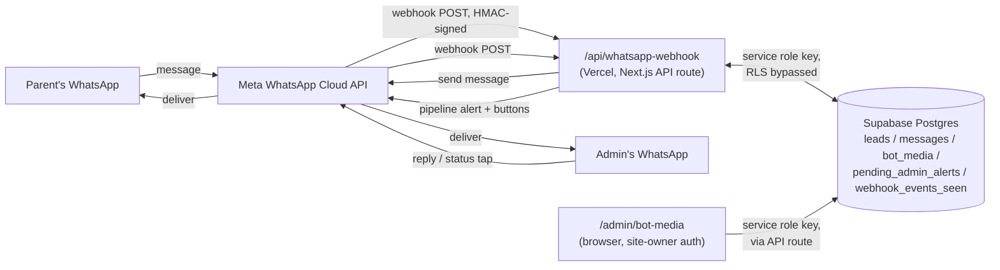
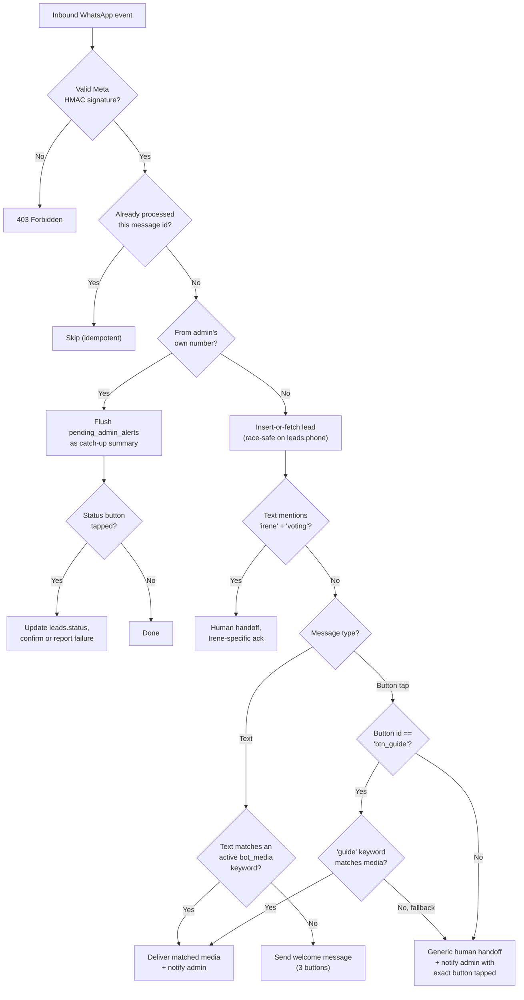

# The RAD Academy WhatsApp Lead Funnel — System Reference

> **What this document is:** a complete business + technical map of the WhatsApp lead-funnel webhook and its supporting admin tools, as they exist as of **2026-08-12**. Written so that months from now, without any memory of building it, you (or anyone continuing this work) can understand *what it does, why it was built this way, and how to safely change it.*
>
> **Source of truth:** `src/app/api/whatsapp-webhook/route.ts` in the `rad-pioneer` repo. This document explains that file and everything around it — it is not a substitute for reading the code when making changes, but it should mean you never have to read it cold.

---

## 1. What This System Is, In One Paragraph

A parent messages RAD Academy's WhatsApp Business number. Within seconds, they're greeted, offered something of immediate value (a free guide), and routed toward a human if they want more. Every message they send creates or updates a **lead record** in the database automatically — no admin has to manually capture a single contact. The moment a lead needs personal attention, the admin (you) gets pinged on WhatsApp, with buttons to jump straight into the conversation and to log what happened once you've made contact. The whole thing runs unattended, 24/7, for the cost of a Vercel function and a WhatsApp Business API call.

This is not a chatbot in the "AI assistant" sense. It has no language model, no free-form understanding. It is a **deterministic funnel router**: match keyword → deliver value → hand off to human → track outcome. That's a deliberate choice, explained in §2.

---

## 2. Why It Exists — The Business Problem and the Psychology Behind the Design

### 2.1 The core problem

Before this system, every WhatsApp enquiry to RAD Academy was a manual conversation with no structured record. Leads got lost in chat history. There was no way to know, at a glance, how many people asked about the guide this week, who tapped "talk to an educator" and never got followed up, or which leads went cold. The business was losing leads not from lack of interest, but from lack of *process* around a channel (WhatsApp) that parents already trust and use daily.

### 2.2 Why WhatsApp, specifically

South African parents overwhelmingly prefer WhatsApp over email or web forms — it's low-friction (no account creation, no forgotten passwords), it's where they already are, and a business replying on WhatsApp feels more like a real conversation than a marketing funnel. This lowers the psychological barrier to that crucial first contact. The tradeoff is that WhatsApp is a *regulated, rate-limited, template-gated* channel (Meta's rules, not RAD's) — most of this system's engineering complexity exists to work within those constraints, not around them.

### 2.3 The reciprocity principle — why "Get Free Guide" delivers instantly

The single most important UX decision in this system: when a parent asks for the guide, **they get it immediately, with zero waiting on a human.** This is a deliberate application of the reciprocity principle (give something of real value before asking for anything back) combined with instant-gratification psychology — any delay between "I want this" and "I have this" is a drop-off risk. A parent who has to wait for a human to manually send a PDF has already lost a meaningful amount of goodwill and attention compared to one who gets it in the same second they tap the button.

This is also why the guide button was recently changed to *bypass* the generic "a human will be in touch" acknowledgment entirely (see §4.7) — that acknowledgment is correct for genuinely open-ended requests ("talk to an educator"), but it's the *wrong* response to a request that the system can already fulfill itself. Making someone wait for a human to do something a database lookup can do instantly is a psychological own-goal.

### 2.4 Human handoff as a relief valve, not a dead end

Every other button tap — "Talk to Educator," "Upcoming Events," anything from a brochure — routes to the same short acknowledgment: *"Got it! One of our educators will be in touch with you shortly."* This is intentional simplicity, not laziness. Two reasons:

1. **Certainty beats false precision.** Early versions of this bot had distinct per-button conversational branches (workshop dates, city-specific copy, a webinar link that was never actually finished). Half-built branches are worse than no branches — a parent hitting a dead-end flow trusts the business *less* than one who gets a clear, honest "a person will help you." The unified handoff was a deliberate trade of breadth for reliability.
2. **It converts every button into a qualified lead signal for the admin**, at no engineering cost — see §2.5.

### 2.5 Speed-to-lead — why the admin gets pinged instantly, with context

In sales, "speed to lead" (how fast a business responds to a new enquiry) is one of the strongest predictors of conversion — response within minutes converts dramatically better than response within hours. Every meaningful funnel event (new lead, guide downloaded, button tapped) fires an immediate WhatsApp alert to the admin, containing the lead's phone number, what they did, and a `wa.me` link that opens a direct chat with one tap. The design goal is: **the gap between "a parent showed interest" and "the admin could reply" should be as close to zero as WhatsApp physically allows.**

### 2.6 Reducing the admin's own friction — why status logging is a button tap, not a dashboard visit

CRMs fail in practice not because they lack features, but because the person who's supposed to update them is busy doing the actual work (talking to the lead) and update-the-database is decision fatigue tax paid after the fact. The `Contacted` / `No Response` / `Follow-up Set` buttons attached directly to the same WhatsApp alert exist to make outcome-logging **the same motion as reading the alert** — no app-switch, no login, no dashboard. This is a direct bet that data hygiene follows the path of least resistance: if logging an outcome takes one thumb-tap inside the app you're already in, it happens; if it takes opening a separate admin panel, it mostly doesn't.

### 2.7 The catch-up summary — designing around WhatsApp's own psychology-hostile constraint

Meta enforces a **24-hour customer service window**: a business can only send free-form messages to a phone number within 24 hours of that number last messaging the business. This applies to the admin's own number too. If the admin doesn't happen to text the bot within 24 hours, every pipeline alert in that window is silently rejected by Meta — not a bug, a platform rule. Rather than fight this (which would require a Meta-approved message template, a multi-day approval process), the system queues what couldn't be delivered and dumps a consolidated **"Missed while you were away"** summary the instant the admin sends the bot anything at all. This accepts the platform's constraint and designs *with* it: nothing is lost, it just arrives clustered at the moment the admin re-engages, which is exactly when they're in a position to act on it anyway.

---

## 3. System Architecture



**Component responsibilities:**

| Component | Role |
|---|---|
| Meta WhatsApp Cloud API | The actual messaging transport. RAD does not talk to parents directly — everything goes through Meta's API, subject to Meta's rules (templates, 24hr window, rate limits). |
| `/api/whatsapp-webhook` (Vercel) | The single entry point for **every** inbound WhatsApp event (parent or admin). Stateless — each request creates its own Supabase client and does its work in one pass. |
| Supabase Postgres | Persistent state: who the leads are, what was said, what media exists to send, what's queued for the admin. |
| `/admin/bot-media` and related admin pages | Human-operated control surfaces, protected by `middleware.ts`'s site-owner auth guard, always using the **service role** key (never the public anon key). |

### 3.1 The key-management model (and the fix made on 2026-08-12)

Supabase issues two kinds of API key:

- **Anon key** (`NEXT_PUBLIC_SUPABASE_ANON_KEY`) — meant for browser code. It is, by design, **public**: it ships inside your site's JavaScript bundle, and anyone can extract it from the page source. Anything it's allowed to do, *anyone on the internet* is allowed to do, governed only by your Row Level Security (RLS) policies.
- **Service role key** (`SUPABASE_SERVICE_ROLE_KEY`) — a genuine secret, never sent to a browser, that bypasses RLS entirely. Safe to use only in code that runs exclusively on your own server.

The webhook and the Irene consent route were both originally built using the anon key — a historical accident, not a deliberate choice, since both are 100% server-side Next.js API routes that never execute in a browser. This meant `leads` and `messages` needed RLS policies open enough for anon to insert/select/update, which in turn meant **anyone who copied the public anon key out of the site's JS could query those tables directly via Supabase's REST API**, bypassing the app entirely. On audit, `leads` had an open `SELECT` policy for anon — a full read of every parent's name, phone number, and funnel status was reachable by anyone with that key.

**Fix (commit `0e94979`):** both routes now use the service role key, matching every `/admin/api/*` route. All anon policies on `leads`, `messages`, `bot_media`, `pending_admin_alerts`, and `webhook_events_seen` were dropped, and RLS was left enabled with zero policies — a fully closed door to the public key, with no scoped-policy tradeoffs to get subtly wrong later.

---

## 4. The Conversation Flow, Stage by Stage



### 4.1 Signature verification (`isValidMetaSignature`)

Every request is checked against Meta's HMAC-SHA256 signature (`x-hub-signature-256` header), computed over the raw request body using `WHATSAPP_APP_SECRET`. This proves the request genuinely came from Meta and not a forged POST from anywhere else on the internet — without it, anyone who discovers the webhook URL could inject fake messages, create fake leads, or trigger arbitrary admin alerts. Uses `timingSafeEqual` specifically to avoid a timing side-channel attack revealing the correct signature byte-by-byte.

### 4.2 Idempotency (`webhook_events_seen`)

Meta's delivery guarantee is **at-least-once**, not exactly-once — the same message can legitimately arrive twice (retries after slow responses, network hiccups on Meta's side). The webhook claims each `message.id` by inserting it into `webhook_events_seen` *before* doing anything else; a unique-constraint violation on that insert means "already handled," and the event is skipped. Without this, a single retried message could create a duplicate lead, send a duplicate guide, or double-alert the admin.

### 4.3 The admin short-circuit (`isFromAdmin`)

Messages from the admin's own number (`ADMIN_PHONE_NUMBER`) never go through the parent-facing funnel logic — they're ops actions, not customer enquiries. This branch does two things, in order:
1. **Flushes any queued alerts** (§4.8) as a catch-up summary.
2. **Processes status-button taps** (§4.9) if the admin's message was a button reply.

Handling this before the general lead-creation logic means the admin's own number is guaranteed to never accidentally become a "lead" in the system.

### 4.4 Lead creation — the race-safe insert pattern

```ts
let { data: lead } = await supabase.from('leads').insert([{ phone: senderPhone, status: 'new_lead' }]).select().single();
if (lead) { /* genuinely new — alert admin */ }
else { /* insert failed on the UNIQUE constraint — someone beat us to it, fetch their row */ }
```

This "insert-first, fallback-select-on-conflict" pattern relies on a **UNIQUE constraint on `leads.phone`** to let Postgres itself arbitrate a race condition — if two webhook deliveries for the same brand-new number land concurrently (plausible under Meta's retry behaviour), only one can win the insert; the loser gracefully falls back to reading the winner's row instead of erroring or creating a duplicate. The same exact pattern is reused in `src/app/api/irene/consent/route.ts` for Irene voting leads — a single agreed-upon idiom for "get-or-create under contention" everywhere leads get created from an external event.

### 4.5 Irene voting support detection

A narrow, hardcoded content match (`text includes "irene"` AND `text includes "voting"`) that exists because the Irene Primary voting page's "Need Help" button prefills exactly that phrase. It's checked and short-circuited (`continue`) before the general funnel logic, because the generic guide/welcome flow would be a jarring non-sequitur for someone who is specifically stuck trying to vote — they need "someone will help you with voting," not "here's our screen-time guide."

### 4.6 Stage 1 — keyword-to-media matching (`matchBotMedia`)

Every inbound **text** message is lower-cased and checked against every *active* row in `bot_media` for a substring match against that row's `trigger_keywords` array. This is intentionally simple substring matching, not NLP — a parent typing "can I get the guide please" matches the `guide` keyword trivially. Two-tier priority: if the lead already carries a `tag_filter`-matching tag (e.g. `Irene Primary`), a tag-specific media entry wins over a generic one using the same keyword — this lets you run *audience-specific* content ("this guide, but only for Irene Primary parents") without any code change, purely from the admin UI.

If nothing matches, the parent gets the catch-all **welcome message** — three buttons: `Get Free Guide`, `Upcoming Events`, `Talk to Educator`.

### 4.7 Stage 2 — button taps, and the one reserved id

Every button tap funnels through one handler. The **default** behaviour, regardless of which button or which flow it came from, is: acknowledge, set `leads.status = 'needs_human'`, alert the admin with the exact button title tapped.

**The one exception** is the id `btn_guide` (used by the welcome message's "Get Free Guide" button). Tapping it re-runs the exact same `matchBotMedia` lookup Stage 1 uses (searching for the literal word `"guide"`), so the parent gets the guide immediately instead of waiting on a human — see §2.3 for why this matters. If no media currently matches `"guide"` (e.g. it was deleted or its keyword renamed), it falls through gracefully to the generic human handoff rather than going silent.

**This makes `btn_guide` a reserved, magic string across the whole system** — if you ever give an unrelated `bot_media` button that exact id (the admin UI's "custom id" field allows this), tapping it will silently redirect to the guide instead of doing what you intended. The `/admin/bot-media` page's warning banner calls this out explicitly for this reason (see §6.1).

### 4.8 The 24-hour window problem and the catch-up summary

`notifyAdmin` sends every pipeline alert as an **interactive button message** (not plain text — see §4.9) to `ADMIN_PHONE_NUMBER`. If Meta rejects the send (the admin hasn't messaged the bot inside the current 24-hour window), the alert is written to `pending_admin_alerts` instead of being silently lost. The next time the admin sends *anything* to the bot — which itself reopens the window — `isFromAdmin` flushes up to 25 queued alerts as one consolidated message (`📋 Missed while you were away (N)`, one line per event with phone, what happened, and a Johannesburg-local timestamp), then deletes the flushed rows. If the flush send itself fails, the rows are left in place rather than deleted, so nothing is ever silently dropped twice.

*Known tradeoff:* the catch-up summary is plain text with no action buttons (a single WhatsApp message can carry at most 3 buttons, but an arbitrary number of queued alerts might need to be shown) — logging status for a *queued* alert still requires manually finding that lead. Acceptable for now; flagged in §8.

### 4.9 Admin status buttons (`STATUS_BUTTONS`)

Every pipeline alert carries three reply buttons — `Contacted`, `No Response`, `Follow-up Set` — mapped to `leads.status` values `contacted` / `no_response` / `followup_scheduled` (with `contacted_at` additionally stamped for the first). Tapping one updates the lead directly from inside the alert (§2.6). The handler verifies the update actually touched a row (`select().maybeSingle()`) before confirming success back to the admin — a deliberate fix (2026-08-12) after the same class of bug ("claims success without checking") had already bitten this system once in `sendWhatsAppMessage` (see §7.3).

---

## 5. Data Model

> Columns listed below are the ones directly referenced in application code (webhook, irene/consent, bot-media admin route). This is **not** a full schema dump — run `\d <table>` in Supabase for the authoritative column list, especially for `leads`, which likely carries more fields (warm-list import fields, location, multi-tag support) than the funnel logic itself touches.

### `leads`
The single source of truth for every person who has ever messaged the bot or entered via the Irene voting consent flow.
- `id` (uuid, PK)
- `phone` (text, **UNIQUE** — the concurrency-safety mechanism described in §4.4)
- `status` (text) — lifecycle values in use: `new_lead` → `needs_human` → `contacted` / `no_response` / `followup_scheduled`. Also `new_lead` is briefly used before Stage 1 routing runs.
- `contacted_at` (timestamptz, set when status becomes `contacted`)
- `tags` (text[], used by the media tag-filter matching in §4.6)
- `source`, `school`, `class`, `name`, `consent_marketing`, `consent_timestamp`, `consent_wording_version`, `consent_source` — populated by the Irene voting consent flow, not the WhatsApp webhook directly.

### `messages`
Full inbound/outbound transcript per lead, `direction` = `inbound`/`outbound`, `body` free text. Outbound rows are written with bracketed status markers (`[Delivered ...]`, `[FAILED to deliver ...: <reason>]`) rather than the raw WhatsApp payload — this makes the delivery outcome greppable directly in the table without cross-referencing logs.

### `bot_media`
Admin-managed content the bot can deliver — see §6 for the full CRUD story. Key columns: `key` (stable slug, optional), `title`, `trigger_keywords` (text[]), `tag_filter` (nullable — audience restriction), `file_url`, `filename`, `caption`, `buttons` (jsonb, max 3, each `{id, title}` with title capped at 20 characters — a hard Meta API limit, not a stylistic one), `active`, `archived`.

### `pending_admin_alerts`
The 24-hour-window overflow queue (§4.8). `lead_phone`, `stage_text`, `created_at`. Deliberately minimal — no `lead_id`, so a flushed catch-up summary can't currently carry action buttons back to the original lead (see §8).

### `webhook_events_seen`
Pure idempotency ledger (§4.2). `wa_message_id` (unique). No other columns needed — its only job is to exist or not exist.

---

## 6. Admin Tooling

### 6.1 `/admin/bot-media` — content without code changes

Before this existed, the guide PDF (link, caption, button copy) was hardcoded directly into the webhook route — every content change needed a code deploy. This page turns "what the bot sends" into pure data: create, edit, duplicate, activate/deactivate, and archive media items, all validated server-side (`validateButtons` enforces Meta's 3-button/20-character rules *before* anything is saved, so a bad edit fails at save-time with a clear error instead of failing silently in production when a parent actually triggers it — this is exactly the class of bug that caused the `error 131009` incident on 2026-08-12).

Deliberate design choices worth understanding if you extend this page:
- **Edit vs. Duplicate vs. Delete vs. Archive** are four distinct actions with different intents: *Edit* changes fields on the existing row (does not re-upload a file — swapping the actual file requires *Duplicate* + a fresh upload, so the old file/URL is never silently invalidated for a row still in use). *Archive* forces `active: false` in the same action (so archiving something can never accidentally leave it still live), while *unarchiving* leaves `active` as-is, requiring a deliberate second tap to re-activate — this asymmetry is intentional, to prevent an old, forgotten piece of content from silently starting to fire again the moment someone un-archives it out of curiosity.
- **The reserved-id warning** (§4.7) — the banner in the button-editing UI exists specifically because `btn_guide` is a magic string the webhook special-cases; nothing in the database schema itself prevents an admin from accidentally reusing it.

### 6.2 Related but out of scope here

`/admin/warm-list` (bulk lead import/review/tagging) and `/admin/api/warm-list/commit` write into the same `leads` table but operate independently of the live webhook — they're a one-time/periodic import tool, not part of the always-on conversation flow. Not detailed in this document; see the code directly if extending that tool.

---

## 7. Security Model

### 7.1 Meta signature verification
Covered in §4.1. Non-negotiable — this is the only thing standing between "a real WhatsApp event" and "anyone who found the URL."

### 7.2 Service role vs. anon key
Covered in depth in §3.1. As of commit `0e94979` (2026-08-12), the webhook and the Irene consent route both use the service role key; `leads`, `messages`, `bot_media`, `pending_admin_alerts`, and `webhook_events_seen` all have RLS enabled with **zero** anon-facing policies. Every other file in the codebase that touches these tables (`/admin/api/*`) already used the service role key — this brings the webhook in line with the rest of the system rather than introducing a new pattern.

### 7.3 A recurring bug class worth naming: "claims success without checking"

Three separate incidents in this system's history share the same root cause — code assumed an operation succeeded and told a human it did, without checking the actual result:
1. `sendWhatsAppMessage` originally logged `[Delivered ...]` and notified the admin regardless of whether Meta actually accepted the send — a button-title-too-long rejection (`error 131009`) was invisible in the data for this reason. Fixed by making it return `{ok, error}` and having every caller branch on it.
2. The admin status-logging buttons (§4.9) originally updated `leads.status` and unconditionally replied "✅ Logged" without checking whether the update actually matched a row. Fixed the same day.
3. (Documented as a residual, lower-severity gap:) the catch-all welcome message's send result is still unchecked — low risk today since its button copy is static and unlikely to trigger a Meta rejection, but inconsistent with the pattern established everywhere else. See §8.

**The lesson for future work on this file:** any `await sendWhatsAppMessage(...)` or `await supabase....update(...)` whose result feeds into a message telling a human "this worked" should check that result. It has been wrong before, silently, in production.

---

## 8. Known Limitations & Deliberately Deferred Work

These are not oversights — each was either explicitly scoped out or is a real, small, low-priority gap worth knowing about before you assume the system does something it doesn't.

- **Catch-up summaries carry no action buttons.** A queued alert flushed after the 24hr window loses its "reply and log status" affordance — the admin has to act on it as free text. Fixable by storing `lead_id` on `pending_admin_alerts` and, if the queue is short, attaching buttons to the flush message; not built because it's genuinely more complex (a summary can legitimately queue more leads than 3 buttons can represent).
- **No real-time admin alerts outside the 24hr window.** The catch-up mechanism is a mitigation, not a fix — an admin who goes several days without texting the bot only finds out about missed leads when they next do. A Meta-approved "utility" message template would allow genuinely proactive alerts regardless of window state, but requires template submission and Meta approval (days), and was explicitly deprioritized in favor of the no-approval-needed catch-up design (2026-08-12).
- **`matchBotMedia` has no deterministic tie-break for overlapping keywords.** If two active, non-tag-filtered `bot_media` rows both match the same inbound text, which one "wins" depends on unspecified database row order (no `ORDER BY` on the lookup query). Not currently observed as a problem because content hasn't overlapped in practice, but a landmine if two similar guides are ever active with shared keywords.
- **A full "admin portal for every automated message" was explicitly requested and explicitly deferred** (2026-08-12, time-boxed by the business owner to "skip if this takes over an hour"). The real scope of that ask is a proper conversation-state-machine admin UI, not a quick extension of `/admin/bot-media` — noted as a next-phase item, not started.
- **The site footer's WhatsApp link points at the wrong number** (`27769065959`, a separate Business-app inbox not connected to this webhook at all — contacts via that link never enter this funnel). Known, explicitly deferred to a later phase by the business owner (2026-08-11).
- **Single-admin design.** `ADMIN_PHONE_NUMBER` is one phone number. If RAD Academy ever needs multiple staff members receiving/acting on alerts, this whole system (the `isFromAdmin` check, the status-button routing, the catch-up queue) assumes exactly one admin identity and would need real multi-user thinking, not a quick env-var change.
- **The welcome message's send result is unchecked** (§7.3) — low risk, flagged for consistency rather than urgency.

---

## 9. Playbook: How to Make Common Changes

**Add or change a piece of content the bot can send** (a new guide, a new brochure): go to `/admin/bot-media`, no code or deploy needed. Remember: button titles are capped at 20 characters by WhatsApp itself, not by the form — a validation error at save time is Meta's real constraint surfacing early, not an arbitrary restriction.

**Change the welcome message's copy or buttons:** this is still hardcoded in `route.ts` (§4.6, the `welcomePayload` object) — not yet data-driven. Editing it requires a code change and a deploy directly to `main` (the standing rule for this file, since branch/local testing has been unreliable against the live Meta WABA integration).

**Add a new automated status the admin can log:** extend the `STATUS_BUTTONS` map near the top of `route.ts`. Each entry needs a `title` (≤20 chars), a `status` value, and a human-readable `label`. No other code changes needed — the button generation, id-matching, and DB update are all driven off that one map.

**Give a piece of content to only a specific audience:** set `tag_filter` on the `bot_media` row to match a tag your leads carry (e.g. `Irene Primary`, set via `/admin/warm-list` or manually). It will only be offered to leads carrying that exact tag; a generic (no `tag_filter`) entry with the same keyword remains the fallback for everyone else.

**Where things live:**

| What | File |
|---|---|
| The webhook itself | `src/app/api/whatsapp-webhook/route.ts` |
| Bot content admin UI | `src/app/admin/bot-media/page.tsx` |
| Bot content CRUD API | `src/app/admin/api/bot-media/route.ts` |
| Irene voting consent → lead creation | `src/app/api/irene/consent/route.ts` |
| Bulk lead import/review tool | `src/app/admin/warm-list/page.tsx` + `src/app/admin/api/warm-list/*` |
| Admin-area auth guard | `src/middleware.ts` |

**Standing operational rule:** changes that touch the live Meta WABA integration (anything in `whatsapp-webhook/route.ts` that affects what gets sent) go straight to `main` after testing — branch/local testing against Meta's live API has been unreliable in this project. Everything else (admin UI, non-webhook routes) can go through a feature branch as normal.

---

## 10. Glossary

- **WABA** — WhatsApp Business Account, Meta's entity representing RAD Academy's business phone number on the platform.
- **Meta Cloud API** — the hosted (not self-managed) version of the WhatsApp Business API that this webhook integrates with.
- **24-hour customer service window** — Meta's rule that free-form messages can only be sent to a number within 24 hours of that number last messaging the business; outside it, only pre-approved message templates can be sent.
- **At-least-once delivery** — Meta's guarantee that a webhook event will be delivered, but possibly more than once (hence the idempotency table).
- **RLS (Row Level Security)** — Postgres/Supabase's per-row access control. A table can have RLS *enabled* with *zero* policies (fully locked, nobody but service-role gets in) or with specific policies scoping exactly what each database role can do.
- **Anon key vs. service role key** — see §3.1. The single most important distinction to hold onto when adding any new table or route to this system: if the code runs in a browser, it's anon and needs careful RLS; if it only ever runs on your server, it should be service role, and RLS should simply deny anon entirely.
- **`error 131009`** — Meta's specific rejection code for an invalid interactive button (used historically when a button title exceeded 20 characters).

---

## 11. Change Log (this document's basis)

| Date | Change | Commit |
|---|---|---|
| 2026-08-12 | Button taps unified into a single human-handoff handler, replacing 5 separate per-button flows | `1a3db8c` |
| 2026-08-12 | "Get Free Guide" bypasses human handoff, delivers instantly; "View Workshops" relabeled "Upcoming Events" | `c0c4408` |
| 2026-08-12 | Admin alerts queued when blocked by the 24hr window; catch-up summary on next admin message | `534f40b` |
| 2026-08-12 | Admin pipeline alerts gained status-logging buttons (Contacted / No Response / Follow-up Set) | `c0a4606` |
| 2026-08-12 | Fixed silent failure on admin status-button DB update; fixed stale/incorrect warning text on bot-media admin page | `2d6ffa2` |
| 2026-08-12 | Webhook and Irene consent route switched from public anon key to service role key; RLS lockdown on 5 tables | `0e94979` |
